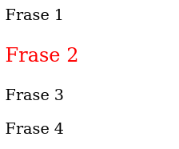
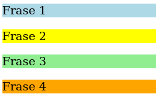
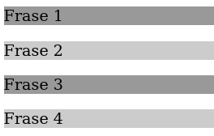

# Referencias - 2º parte

## Otros atributos

Para las situaciones en que los atributos *id* y *class* no son suficientes, CSS permite referenciar un elemento por medio de cualquier otro atributo que necesitemos. La sintaxis requerida incluye el nombre del elemento seguido del nombre del atributo en corchetes.

El siguiente ejemplo muestra la regla para elementos que contengan un atributo específico, en este caso *name:*

```
p[name] {
  font-size: 20px;
}
```

Y aquí operamos de igual manera que hicimos con *id* y *class*, incluyendo el valor del atributo:

```
p[name="mitexto"] {
  font-size: 20px;
}
```

CSS nos permite combinar el caracter **=** con otros para realizar una selección más específica. Aquí algunos de los más usados:

```
p[name~="mi"] {
  font-size: 20px;
}
p[name^="mi"] {
  font-size: 20px;
}
p[name$="mi"] {
  font-size: 20px;
}
p[name*="mi"] {
  font-size: 20px;
}
```

- **~=** referencia cualquier elemento `<p>` que contenga el atributo *name* y su valor **contenga la palabra "mi".**

- **^=** referencia al elemento `<p>` cuyo valor del atributo *name* **empiece por "mi".**

- **$** referencia al elemento `<p>` cuyo valor de su atributo *name* **termine por "mi".**

- **\*=** referencia a cualquier elemento `<p>` cuyo valor de atributo *name* **contenga la cadena de caracteres "mi"**, aunque sea en mitad de una palabra.

## Seudoclases

Son herramientas especiales de CSS que nos permiten referenciar elementos por sus características, posición en el código o condiciones actuales. Para verlo, usaremos este documento HTML sencillo:

```
<!DOCTYPE html>
<html lang="es">
<head>
  <title>Este texto es el título del documento</title>
  <meta charset="utf-8">
  <link rel="stylesheet" href="misestilos.css">
</head>
<body>
  <main>
    <section>
      <p class="mitexto1">Frase 1</p>
      <p class="mitexto2">Frase 2</p>
      <p class="mitexto3">Frase 3</p>
      <p class="mitexto4">Frase 4</p>
    </section>
  </main>
</body>
</html>
```

Ahora empezaremos a aplicar estilos con Seudoclases:

- **:nth-child(valor)** selecciona un elemento de una lista de elementos hermanos que se encuentra en la posición indicada entre paréntesis:

  ```
  p:nth-child(2) {
    font-size: 20px;
    color:red;
  }
  ```

  

  ```
  p:nth-child(1) {
    background-color: lightblue;
  }
  p:nth-child(2) {
    background-color: yellow;
  }
  p:nth-child(3) {
    background-color: lightgreen;
  }
  p:nth-child(4) {
    background-color: orange;
  }
  ```

  

  Si tuviéramos una lista muy larga y no nos importase limitar el color de fondo a únicamente 2 colores, podemos usar las palabras clave disponibles para esta seudoclase **odd** y **even**. Eso nos permitirá ir alternando los colores para cada elemento `<p>` hijo de otro elemento en función de si su lugar en la lista es par o impar, sin importar lo larga que sea la lista:

  ```
  p:nth-child(odd) {
    background-color: #999999;
  }
  p:nth-child(even) {
    background-color: #CCCCCC;
  }
  ```

  
