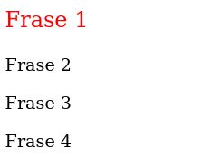
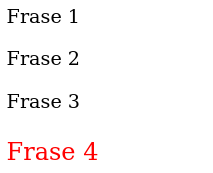
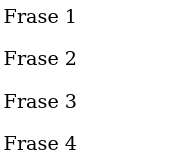
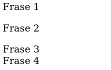

# Referencias - 3º parte

## Continuación Seudoclases

- **:first-child** seleccionará el primer elemento de una lista de elementos:

  ```
  p:first-child {
    font-size: 20px;
    color:red;
  }
  ```

  

- **:last-child** seleccionará el último de la lista:

  ```
  p:last-child {
    font-size: 20px;
    color:red;
  }
  ```

  

- **:only-child** selecciona un elemento cuando es el único hijo de otro:

  ```
  p:only-child {
    font-size:20px;
    color:red;
  }
  ```

  

  Al no haber un sólo elemento hijo sino cuatro, no se aplica a ninguno.

- **:first-of-type** selecciona el primer elemento de una lista de elementos del mismo tipo:

  ```
  p:first-of-type {
    font-size:20px;
    color:red;
  }
  ```

  

  En este caso, obtenemos el mismo resultado que con **p:first-child**

- **:not(selector)** seleccionará los elementos que **no** coinciden con el selector entre paréntesis:

  ```
  section :not(.mitexto2) {
    margin: 0px;
  }
  ```

  

  Se aplica el margen de 0px al primer, tercer y cuarto elemento pero se excluye al incluído entre paréntesis.
