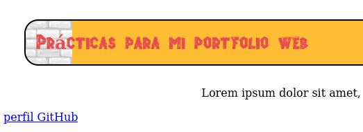
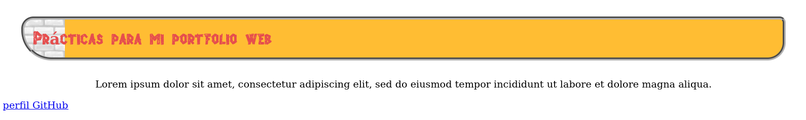

# Propiedades - 5ª parte

## Continuación Bordes

Si nuestro diseño requiere bordes redondeados podemos usar la siguiente propiedad:

- **border-radius** define el radio del círculo virtual que el navegador utilizará para dibujar las esquinas de nuestro borde.
Si queremos que las esquinas sean diferentes, tendremos que asignar diferentes valores a cada una de ellas. También se puede separar el borde horizontal del vertical usando una barra oblicua entre el valor de cada radio:

  ```
  header{
    border: 2px solid black;
    border-radius: 20px;
    margin: 30px;
    padding:15px;
    /*text-align: center;*/
    background: #ffbd33 url("Media/ladrillosclaros.jpg") repeat-y;
  }
  ```


  ```
  header{
    border: 5px groove black;
    border-radius: 20px 10px 30px 50px;
    margin: 30px;
    padding:15px;
    background: #ffbd33 url("Media/ladrillosclaros.jpg") repeat-y;
  }
  ```

  

  Y ahora un ejemplo con diferentes valores para el radio horizontal y vertical:

  ```
  header{
    border: 2px solid black;
    border-radius: 20px/40px;
    margin: 30px;
    padding:15px;
    text-align: center;
    background-image: url(Media/ladrillosclaros.jpg);
  }
  ```

