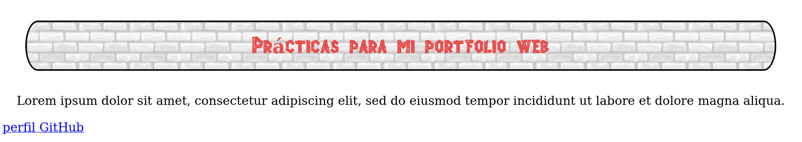

# Propiedades - 5ª parte

## Continuación Bordes

Si nuestro diseño requiere bordes redondeados podemos usar la siguiente propiedad:

- **border-radius** define el radio del círculo virtual que el navegador utilizará para dibujar las esquinas de nuestro borde.
Si queremos que las esquinas sean diferentes, tendremos que asignar diferentes valores a cada una de ellas. También se puede separar el borde horizontal del vertical usando una barra oblicua entre el valor de cada radio:

  ```
  header{
    border: 2px solid black;
    border-radius: 20px;
    margin: 30px;
    padding:15px;
    /*text-align: center;*/
    background: #ffbd33 url("Media/ladrillosclaros.jpg") repeat-y;
  }
  ```


  ```
  header{
    border: 5px groove black;
    border-radius: 20px 10px 30px 50px;
    margin: 30px;
    padding:15px;
    background: #ffbd33 url("Media/ladrillosclaros.jpg") repeat-y;
  }
  ```

  

  Y ahora un ejemplo con diferentes valores para el radio horizontal y vertical:

  ```
  header{
    border: 2px solid black;
    border-radius: 20px/40px;
    margin: 30px;
    padding:15px;
    text-align: center;
    background-image: url(Media/ladrillosclaros.jpg);
  }
  ```


Existen unas propiedades para dibujar un segundo borde llamado **outline.** Los valores para definirlos son similares al **border** normal. Tenemos *width, style (con los mismos parámetros que border), color* y como novedad el parámetro **offset**, que define el espacio entre el **outline border** y los límites de la caja del elemento. Aceptará valores en cualquiera de las unidades disponibles en CSS (px, %, em, etc...)

- **outline** permite definir al mismo tiempo todos los parámetros salvo **outline-offset**.

Aqui un ejemplo de un segundo borde externo sobre el título que ya teníamos montado:

```
header{
  border: 2px solid black;
  border-radius: 20px/40px;
  outline: 2px dashed #000000;
  outline-offset: 15px;
  margin: 30px;
  padding:15px;
  text-align: center;
  background-image: url(Media/ladrillosclaros.jpg);
}
```


Para ir más allá de unas meras líneas con diferente formato o estilo, CSS permite también configurar bordes de forma menos simple con las siguientes propiedades:

- **border-image-source** define la imagen que se usará para crear el borde a través de la función *url()*.

- **border-image-width** define el ancho del borde en cualquiera de las unidades disponibles en CSS.

- **border-image-repeat** define cómo se usará la imagen para definir el borde. Los valores posibles son *repeat, round, stretch, space.*

- **border-image-slice** define como se va a cortar la imagen para representar las esquinas del borde. Debemos asignar cuatro valores para especificar los cuatro trozos de la imagrn que se utilizarán. Si solo se declara un valor, se usa para todos los lados. Se puede especificar como entero o en porcentaje.

- **border-image-outset** define la distancia a la que se encuentra la imagen de la caja del elemento. Acepta los valores de CSS como *px, %, em,* etc...)

- **border-image** nos permite especificar el valor de los atributos anteriores al mismo tiempo.

Para lograr el objetivo de usar una imagen como borde a través de las propiedades descritas, necesitamos declarar tres atributos: **la ubicación del archivo (border-image-source), el tamaño de las piezas que queremos extraer del patrón (border-image-slice) y las palabras clave que determinan como se van a distribuir las piezas alrededor del elemento.**

Por ejemplo, aquí declaramos un borde de 29px de ancho y después de cargar la imagen, asignamos a las piezas a usar un tamaño de 29px también (que coincide con el tamaño del rombo completo) con la propiedad **border-image-slice**. Luego, al definir **stretch**  como valor de la propiedad **border-image-repear** estira la pieza en caso necesario para cubrir todo el lado, en este caso la anchura:

```
header {
  margin: 30px;
  padding: 15px;
  text-align: center;
  border: 29px solid;
  border-image-source: url("Media/diamantes.png");
  border-image-slice: 29;
  border-image-repeat: stretch;
}
```


También podemos declarar los valores de golpe usando la propiedad **border-image:**

```
header {
  margin: 30px;
  padding: 15px;
  text-align: center;
  border: 29px solid;
  border-image: url("Media/diamantes.png") 29 round;
}
```


