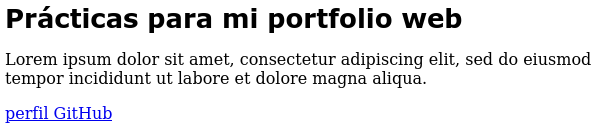

# Propiedades

Todos los estilos que podemos aplicar a un elemento se definen por propiedades. Para simplificar su estudio, se pueden clasificar en 2 clases: de **formato** y de **diseño**

Las propiedades de formato se encargan de dar forma a los elementos y su contenido. Las de diseño están enfocadas a determinar el tamaño y la posición de los elementos en la pantalla.

## Propiedades de formato

**Texto**

- **font-family** declara el tipo de texto que se usa para mostrar el texto. Se pueden declarar múltiples valores separados por coma para dar al navegador varias posibilidades en caso de que algunos tipos de fuente no se encuentren disponibles en el navegador del usuario. Algunos de los tipos más comunes son *Georgia*, *Times New Roman*, *Arial*, *Helvetica*, *Arial Black*, *Gadget*, *Tahoma*, *Geneva*, *Verdana*, *Impact* y *sans-serif* (los nombres compuestos por más de una palabra se deben declarar por comillas dobles.)

- **font-size** determina el tamaño de la letra. Se puede declarar en píxeles (px), porcentaje (%), o usando cualquiera de las unidades disponibles en CSS como **em, rem, pt**, etc. El valor por defecto normalmente es **16px**

- **font-weight normal** y **bold** son los valores disponibles para determinar si la letra se mostrará en negrita o no, pero también se puede usar las centenas redondas de **100** a **900** para determinar el grosor de la letra (sólo disponible para algunos tipos de letra)

- **font-style** determina el estilo de la letra con los valores **normal, italic y oblique.**

- **font** esta propiedad nos permite declarar múltiples valores. El estilo y el grosor se deben declarar antes que el tamaño, y el estilo de letra al final. Por ejemplo: **font: bold 24px Arial, sans-serif**   

Vamos a visualizar diferentes estilos de formato de texto a partir del siguiente documento de ejemplo que incluye un título y más abajo una sección con un párrafo, donde aplicaremos diferentes estilos usando las referencias vistas anteriormente:

```
<!DOCTYPE html>
<html lang="es">
<head>
  <title>título en pestaña</title>
  <meta charset="utf-8">
  <link rel="stylesheet" href="misestilos.css">
</head>
<body>
  <header>
    <span id="titulo">Prácticas para mi portfolio web</span>
  </header>
  <section>
    <p id="descripcion">Lorem ipsum dolor sit amet, consectetur adipiscing elit, sed do eiusmod tempor incididunt ut labore et dolore magna aliqua. </p>
  </section>
  <footer>
    <a href="https://github.com/ehdinayan">perfil GitHub</a>
  </footer>
</body>
</html>
```

La regla CSS para el título:

```
#titulo {
  font-family: Verdana, sans-serif;
  font-size: 26px;
}
```
O usando una sola línea de código:

```
#titulo {
  font: bold 26px Verdana, sans-serif;
}
```



- **text-align** Alinea el texto dentro de un elemento. Los valores disponibles son *left, right, center, justify:*

```
#titulo {
  font: bold 26px Verdana, sans-serif;
}
#descripcion {
  text-align: center;
}
```


- **word-spacing** define el ancho del espacio entre palabras. Puede ser declarado en píxeles, porcentaje o en cualquiera de las unidades de CSS que vimos en font-size.

```
#titulo {
  font: bold 26px Verdana,sans-serif;
}

#descripcion {
  text-align: center;
  word-spacing: 20px;
}
```

