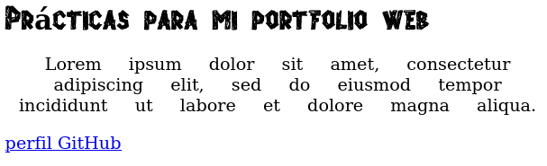
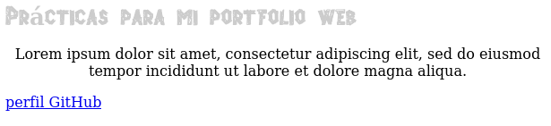
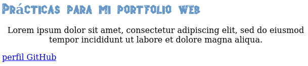
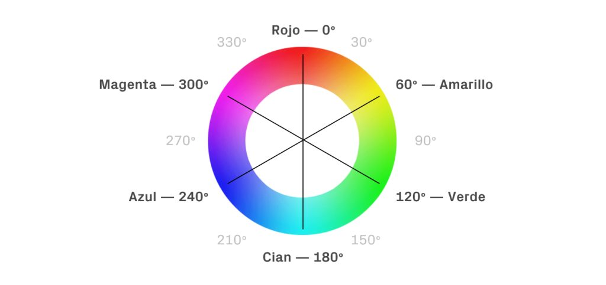
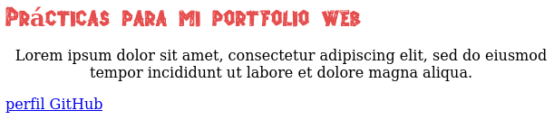

# Propiedades - 2º parte

## Continuación propiedades de formato para Texto


- **vertical-align** se usa frecuentemente para alinear texto con imágenes (la propiedad se aplica a la imagen). Los valores disponibles son *baseline, top, bottom, sub, super, text-top, text-bottom y middle.

Las fuentes usadas hasta ahora, *Verdana* y la alternativa *sans-serif* en caso de que la primera no esté disponible se encuentran en el grupo de fuentes conocidas como seguras, ya que se encuentran disponibles en la mayoría de ordenadores.

El caso es que los navegadores no descargan un archivo de fuentes desde el servidor, sino que usan las del ordenador del usuario.
Esto quiere decir que si usamos una fuente que el ordenador del usuario no posee, nuestra web se verá diferente. Por otro lado, las fuentes del grupo seguras no son muchas y eso limita la creatividad.

Para solucionar esto, CSS incluye la regla `@font-face`. Esto permite a los diseñadores incluir un archivo con la fuente de letra a usar para mostrar el texto de su página web. Esta regla necesita dos propiedades para funcionar: *font-family* y *src*, que usará a su vez la función *url()* para indicar la ruta al archivo.

Esta seria la regla para incorporar la nueva fuente:

```
#titulo {
  font: bold 26px MiNuevaLetra, Verdana, sans-serif;
}
@font-face {
  font-family: MiNuevaLetra;
  src: url(Fonts/AlphaWood.ttf);
}
```




## Colores

Existen 2 formas de declarar colores en CSS: podemos usar una combinación de tres colores básicos (rojo, verde y azul) o definir el matiz, la saturación y la luminosidad. El color final se crea considerando los niveles que asignamos a cada componente. Dependiendo del tipo de sistema que utilizamos para definir el color, tendremos que declarar los niveles usando números hexadecimales (desde 00 a FF), números decimales (desde 0 a 255) o porcentajes.

Por ejemplo, si decidimos usar una combinación de niveles de rojo, verde y azul, podemos declarar los niveles con números hexadecimales. En este caso, los valores del color se declaran en secuencia y precedidos por el carácter numeral, como en #996633 (99 es el nivel de rojo, 66 el de verde y 33 el de azul)

Aqui están las maneras en las que CSS permite declarar colores:

- **rgb** Lo que acabamos de explicar. Los valores van de 0 a 255 para cada canal de color.

- **rgba** rojo, verde, azul y añade un último componente para determinar la opacidad, alfa. El valor se puede declarar entre 0 y 1, siendo 0 totalmente transparente y 1 totalmente opaco.

- **hsl** matiz, saturación, luminosidad. Estos valores de declaran por números decimales y  porcentajes.

- **hsla** se vuelve a añadir también un componente para la opacidad, alfa, con valores posibles entre 0 y 1.

- **color** es la propiedad que se usa con más frecuencia, normalmente se declara usando el código hexadecimal o bien el nomnbre del color.

Ejemolo de regla asignando color:

```
#titulo {
  font: bold 26px Verdana, sans-serif;
  color: #CCCCCC;
}
```
Como en este caso el nivel de rojo verde y azul son igualea, el color se encuentra en una escala de grises:

  

Ahora un ejemplo declarando el color con una función:

```
#titulo {
  font: bold 26px MiNuevaLetra/*Verdana,sans-serif*/;
  color: rgb(100, 150, 200);
}
```



La otra función disponible como hemos visto es **hsl().** A algunos diseñadores les resulta más fácil crear grupos de colores usando hsl(). Esta función define *matiz, saturación y luminosidad*. **El matiz** se extrae de una rueda imaginaria, expresado en grados entre 0 y 360, siendo alrededor de 0 y 360 los rojos, cerca de 120 los verdes y cerca de 240 los azules. **La saturación**, en cambio, se expresa en porcentajes entre 0 y 100%, igual que **la luminosidad**, donde un valor de 0% es totalmente negro y el de 100% totalmente blanco.

Aquí tenemos la **rueda de color hsl** para aplicar color en CSS de forma intuitiva:



Este es el color rojo obtenido con una saturación de 75% y luminosidad de 60%:

```
#titulo {
  font: bold 26px MiNuevaLetra/*Verdana,sans-serif*/;
  color: hsl(0, 75%, 60%);
}
```




*NOTA: Existe en CSS la propiedad opacity para declarar la opacidad de un elemento, lo que pasa es que presenta el problema de que si el elemento contiene a su vez elementos hijos, estos también heredarán la misma opacidad. Para evitarlo, nos valdremos de las funciones previamente explicadas (rgba y hsla) para declarar la opacidad de un elemento, así no hay que preocuparse de que otros elementos contenidos en el hereden los mismos valores.*  
