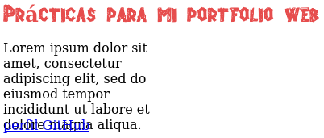
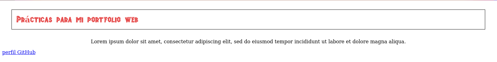
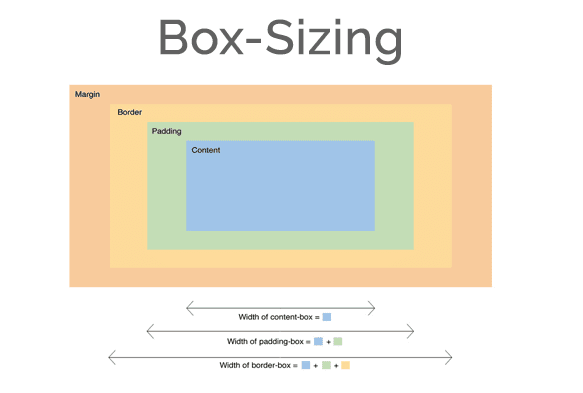

# Propiedades - 3º parte

## Tamaño

Por defecto, el tamaño de la mayoría de los elementos se determina según el espacio disponible en el contenedor. El ancho de un elemento se define como 100% y tendrá una altura determinada por el contenido.

CSS provee las siguientes propiedades para definir un tamaño personalizado:

 - **width** se puede especificar en *píxeles, porcentaje*, o con la palabra *auto (valor por defecto)*. Cuando se expresa en porcentaje, el ancho se calcula según el navegador en función del ancho del contenedor.

 - **height** exactamente como la anchura, pero aplicado a la altura.

Los navegadores determinan por defecto el área a ocupar por un elemento. Cuando el tamaño se modifica, la caja se modifica y el contenido del elemento se adapta para encajar dentro de la nueva área:

 ```
 #descripcion {
  width: 200px;
}
```
Hemos limitado el ancho del elemento *descripción* a 200px, entonces:


Si limitamos también la altura y la determinamos a una medida poco apropiada, puede ocurrir que elementos de nuestra página queden superpuestos de mala manera:

```
#descripcion {
  width: 200px;
  height: 80px;
}
```



En CSS, existen propiedades también para tratar con este tipo de situaciones:

- **overflow** esta propiedad especifica cómo se tratará el contenido que desborda el elemento. Los valores posibles son:
  - **visible (por defecto)**
  - **hidden** esconde el contenido que no entra dentro de la caja.
  - **scroll** muestra barras laterales con las que desplazar el contenido.
  - **auto** deja en manos del navegador lo que hacer con el contenido.


- **overflow-x, overflow-y** tendrán el mismo cometido que la propiedad anterior, solo que aplicado a la anchura y a la altura. Aceptarán también los mismos valores.

Ejemplo aplicando overflow a nuestro documento de prácticas:

```
#descripcion {
  width: 200px;
  height: 50px;
  overflow: scroll;
}
```


El tamaño de un elemento engloba también el relleno y los márgenes de la caja que lo contiene. Eston son los atributos que definen estas propiedades:

- **margin** es el espacio que hay alrededor de la caja. Puede recibir cuatro valores en una misma instrucción separados por un espacio ( *margin: 10px 30px 50px 75px* ) refiriéndose a las posiciones arriba, derecha, abajo, e izquierda respectivamente.

  También puede recibir dos instrucciones ( *margin: 10px 30px* ) con lo que estamos diciendo que aplique el mismo margen abajo que arriba y a la izquierda el mismo que a la derecha. De igual manera, si asignamos sólo un valor, se aplicará el mismo a todas las posiciones.

  También se pueden declarar uno por uno independientemente como *margin-top, margin-right, margin-bottom* y *margin-left.*

  Por último, la propiedad también acepta el valor *auto* para indicar que sea el navegador el que calcule el margen necesario para centrar el elemento en su contenedor.

- **padding** es el espacio entre el contenido de un elemento y los límites de su caja ( **border** ). Se declara exactamente igual que su homónimo para el espacio exterior.

Veamos un ejemplo donde declaramos *margin y padding* al encabezado de nuestro documento y añadimos valor a la propiedad **border** para que el resultado se visualice mejor:

```
header{
  border: 1px solid black;
  margin: 30px;
  padding:15px
}

#descripcion {
  text-align: center;
}
```


El tamaño de un elemento siempre toma en consideración la medida exterior incluyendo sus márgenes. Por ejemplo, si declaramos una anchura para un elemento de 200px, y le damos un margin de 10px a cada lado, el tamaño de anchura total del elemento serán 220 px.


