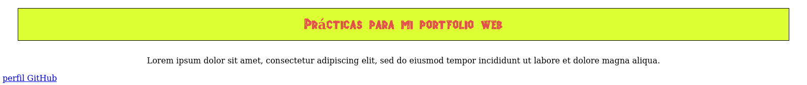
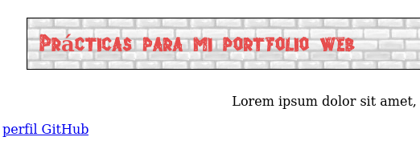
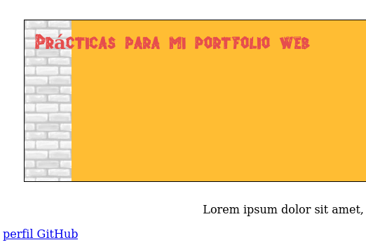

# Propiedades - 4º parte

## Fondo

Los fondos de los elementos pueden estar compuestos por colores e imágenes, por ejemplo, y CSS provee varias propiedades para definirlos:

- **background-color** asigna un fondo de color a un elemento.

- **background-image** asigna una o varias imágenes al fondo de un elemento. La url del archivo se declara con la función **url()**. Si se indica más de una imagen, los valores se deben separar por una coma.

  Aqui un ejemplo del texto del título ahora centrado con color de fondo aplicado.

  ```
  header{
    border: 1px solid black;
    margin: 30px;
    padding:15px;
    text-align: center;
    background-color: rgb(219, 255, 51);
  }
  ```
  

  Y aquí añadiendo de fondo una de las imágenes de los recursos del libro ( Dejaré el título sin centrar para que se aprecie mejor la imagen ):

  ```
  header{
    border: 1px solid black;
    margin: 30px;
    padding:15px;
    background-image: url(Media/ladrillosclaros.jpg);
  }
  ```


- **background-position** declara la posición de comienzo de una imagen de fondo. Los valores se pueden expresar en porcentaje, píxeles o usando una combinación de las palabras clave **center, right, top, left, bottom**

- **background-size** declara el tamaño de la imagen de fondo. Los valores se pueden declarar en porcentajes, píxeles o con las palabras clave **cover, contain.**
Cover expande la imagen hasta cubrir el borde del elemento y contain estira la imagen hasta ocupar toda el área del elemento.

- **background-repeat** determina como se distribuye la imagen de fondo usando la palabra clave **repeat, repeat-x, repeat-y, no-repeat.** Repeat repite la imagen en ambos ejes, y no-repeat no la repite, pone la imagen tal cual es.

- **background-origin** determina si la imagen de fondo se posicionará considerando el borde, el relleno o el contenido del elemento asignando los valores **border-box, padding-box, content box** respectivamente.

  *NOTA: En esta última propiedad he estado haciendo unas pruebas y la imagen siempre ocupa toda el área del elemento, lo que pasa es que la imagen se expande o contrae ligeramente. Parece que como queda mejor es con content-box.*

- **background-clip** usa los mismos valores que la propiedad anterior, pero para indicar donde queremos cortar la imagen. No parece haber diferencia entre **border-box** y **padding-box**, pero con **content-box** la imagen no llena todo el elemento, al menos en Firefox y queda bastante bien.

- **background** nos permite definir las propiedades relativas a este elemento todas de golpe. En el siguiente ejemplo añadimos altura al elemento para ver como se aplica la propiedad de imagen *background-repeat,* combinando imagen y color de fondo:

  ```
  header{
    height: 200px;
    border: 1px solid black;
    margin: 30px;
    padding:15px;
    background: #ffbd33 url("Media/ladrillosclaros.jpg") repeat-y;
  }
  ```
  
