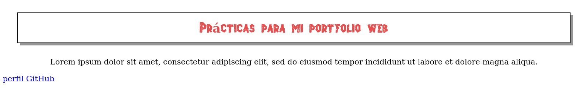
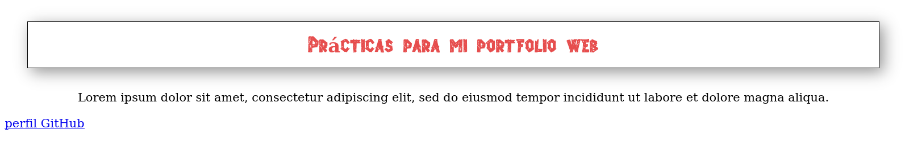
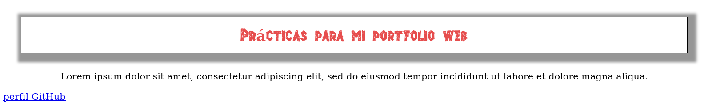
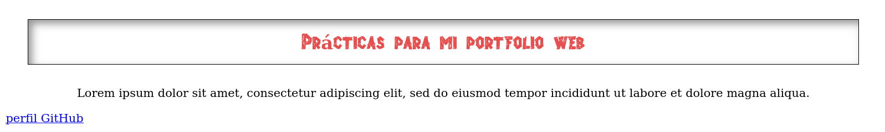
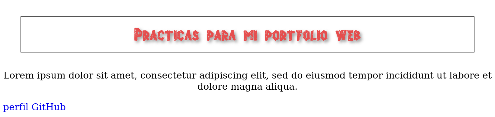
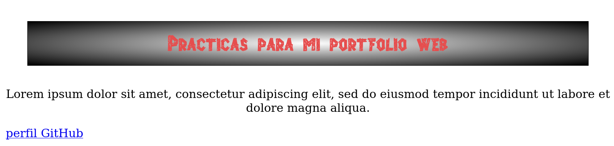
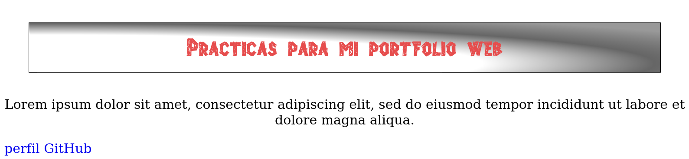

# Propiedades - 6ª parte

## Sombras

Otro efecto interesante que podemos aplicar a un elemento son las sombras. CSS incluye las siguientes propiedades para generar sombras para la caja de un elemento y también para formas irregulares como texto:

- **box-shadow** declara una sombra para la caja. Acepta hasta seis valores. Podemos declarar el *desplazamiento horizontal y vertical de la sombra*, el *radio de difuminado*, el *valor de propagación*, el *color de la sombra* y también podemos incluir el valor *inset* para que la sombra se proyecte dentro de la caja.

- **text-shadow** genera una sombra desde un texto. Podemos declarar el *desplazamiento horizontal y vertical* de la sombra, el *color* y el *radio de difuminado.*

**box-shadow** precisa al menos tres valores para poder determinar el color y el desplazamiento de la sombra. 0 es sin desplazamiento, valores positivos ubican la sombra a la derecha y bajo el elemento, valores negativos la ubican a la izquierda y sobre el elemento.

Ejemplo de sombra sencilla sobre elemento cabecera de documento:

```
header {
  margin: 30px;
  padding: 15px;
  text-align: center;
  border: 1px solid;
  box-shadow: rgb(150,150,150) 5px 5px;
}
#titulo {
  font: bold 26px "MiNuevaLetra",Verdana,sans-serif;
}
```


Y ahora la misma sombra agregando una distancia de difuminado:

`box-shadow: rgb(150,150,150) 5px 5px 20px;`



Al agregar otro valor en píxeles al final de la propiedad, podemos propagar la sombra. Si añadimos otro valor más, estaremos estableciendo el valor de propagación del la sombra del elemento:

`box-shadow: rgb(150,150,150) 5px 5px 5px 10p;`



Podemos sustituir el valor de propagación por la palabra *inset* para mcombrobar como la sombra se proyecta en el interior del elemento:

`box-shadow: rgb(150,150,150) 5px 5px 10px inset;`



La propiedad *text-shadow* se aplica declarando el color de la sombra para el texto, la distancia horizontal y vertical de la sombra al texto y el radio de difuminado:

```
header {
  margin: 30px;
  padding: 15px;
  text-align: center;
  border: 1px solid;
}
#titulo {
  font: bold 26px "MiNuevaLetra", Verdana,sans-serif;
  color: hsl(0, 75%, 60%);
  text-shadow: rgb(150, 150, 150) 3px 3px 5px;
}
```



## Gradientes

Los gradientes se agregan al elemento con los atributos **background-image** o **background.** Para crear la imagen con el gradiente, CSS ofrece las siguientes funciones:

- **radial-gradient(posición, forma, colores, extensión)** crea un gradiente radial. El atributo **posición** indica el origen del gradiente y se puede declarar en píxeles, porcentaje, o por medio de la combinación de los valores *center, top, bottom, left y right*, el atributo **forma** se declara con los valores *circle y ellipse*.
El atributo **colores** es la lista de los colores que participan en el gradiente separados por coma, y el atributo **extensión** determina la forma que el gradiente va a adquirir con los valores *closest-side, closest-corner, farthest-side y farthest-corner.*

  Los valores para el atributo **colores** pueden incluir un segundo valor por porcentaje separado por un espacio para indicar la posición donde finaliza el color.

  Los gradientes se declaran como imágenes de fondo, como se aprecia el ejemplo:

  ```
  header {
  margin: 30px;
  padding: 15px;
  text-align: center;
  border: 1px solid;
  background: -moz-radial-gradient(center, ellipse, #FFFFFF, #000000);
  }
  ```
  

  Algunas propiedades y funciones CSS todavía se consideran experimentales, así que se requiere de prefijos para indicar el motor web a utilizar. Por eso el prefijo -moz- delante de la función radial-gradient, correspondiente al navegador Firefox.

  Los prefijos para Chrome y Safari, Opera e Internet Explorer son **-webkit-, -o-, ms** respectivamente.

  La posición del gradiente se puede personalizar y podemos usar varios colores  con un segundo valor para determinar el límite de cada uno de ellos:

  `background: -webkit-radial-gradient(30px 50px, ellipse, #FFFFFF 50%, #666666 70%, #999999 90%);`

  

  
