# Propiedeades - 7ª parte

## Continuación Gradientes

- **linear-gradient(posición,angulo,colores)** crea un gradiente lineal. La **posición** se declara con los valores *top, bottom, left, right.* El atributo **ángulo** define la dirección del gradiente y se puede declarar con las unidades *deg* (grados), *grad* (gradianes), *rad* (radianes), o *turn* (espiras). El atributo colores es la lista de colores que participan en el gradiente separados por coma. También pueden incluir un segundo valor separado por un espacio para definir mediante porcentaje la posición donde finaliza el color:

```
header {
  margin: 30px;
  padding: 15px;
  text-align: center;
  border: 1px solid;
  background: -moz-linear-gradient(top, #FFFFFF, #666666);
}
```
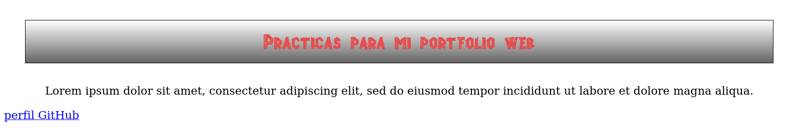

También se puede comenzar el gradiente desde una esquina del elemento, como en el siguiente ejemplo:

`background: -moz-linear-gradient(top right, #FFFFFF, #666666);`

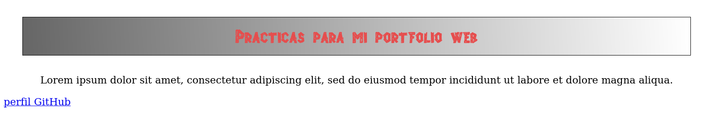

También podemos configurar la dirección con un ángulo en grados:

`background: -moz-linear-gradient(30deg, #FFFFFF, #666666);`

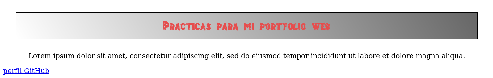

*NOTA: Con esta configuración, los valores 0, 90, 180, 270 equivalen a las posiciones left, bottom, right, y top respectivamante.*

También es posible crear gradientes multicolor:

`background: -moz-linear-gradient(top, white 15%, lightblue 50%, blue);`

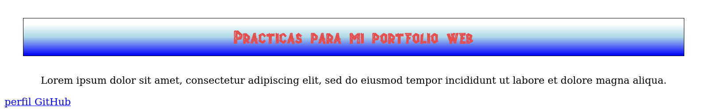

Otra cosa que podemos hacer es que el gradiente sea translúcido, de forma que el fondo se vea a través de él. Este efecto también se puede lograr usando la propiedad rgba() vista anteriormente. Aqui asignamos una imagen de fondo al cuerpo del documento para realizar la comprobación:

```
body {
  background: url("Media/ladrillosclaros.jpg");
}
header {
  margin: 30px;
  padding: 15px;
  text-align: center;
  border: 1px solid;
  background: -moz-linear-gradient(top, transparent, #666666);
}
```

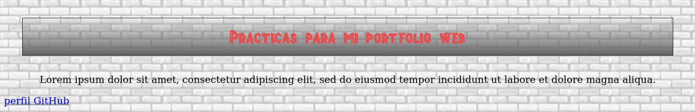

# Filtros

Los filtros agregan efectos a un elemento y su contenido. CSS incluye la propiedad *filter* para asignar un filtro a un elemento y las siguientes funciones para crearlo:

- **blur(valor)** produce efecto de difuminado, valores en píxeles de 1 a 10:

  ```
  header {
  margin: 30px;
  padding: 15px;
  text-align: center;
  border: 1px solid;
  background: -moz-linear-gradient(top, transparent, #666666);
  filter: blur(2px);
  }
  ```

  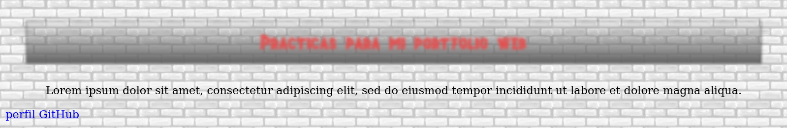

- **grayscale(valor)**convierte los colores de una imagen a escala de grises. Valor en núm decimales entre 0 y 1.

- **drop-shadow(x,y, tamaño, color)**genera una sombra con los valores de los atributos indicados:

  `filter: drop-shadow(5px 5px 1px #000000);`

  Esta sombra se genera para el texto en el elemento y el borde de su caja al ser el header translúcido:

  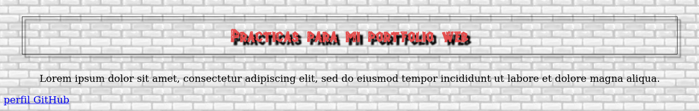

- **sepia** otorga un tono ocre a los valores de la imagen, valores entre 0.1 y 1.

- **brightness(valor)** cambia el brillo de la imagen. Acepta valores entre 0.1 y 10:

  ```
  .plane img {
    width:350px;
    filter:brightness(1);
  }
  ```
  Con el valor de 1 mantenemos el brillo original, si ponemos 0 se ve todo negro:

  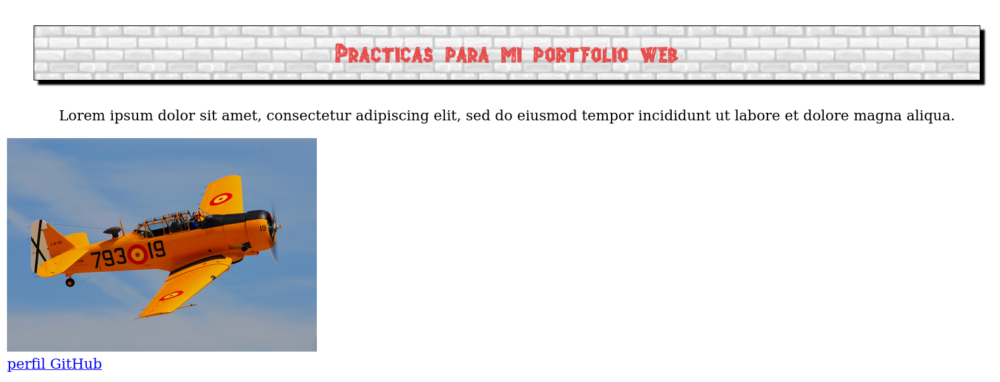

  Ahora la misma imagen con un valor de filtro brightness de 5:

  `filter:brightness(5);`

  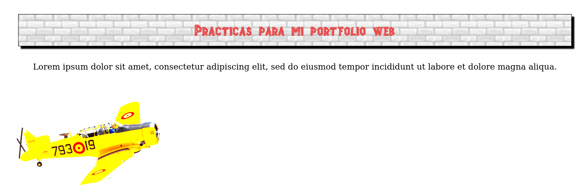

- **contrast(valor)** cambia el contraste de la imagen. Acepta valores 0.1 y 10

- **hue-rotate(valor)** aplica una rotación a los matices de la imagen. Acepta valor en grados desde 1 a 360deg. Comparada con la imagen original, al aplicar una rotación de 180º obtenemos los colores del cielo en el avión y viceversa, al menos eso parece...

  ```
  .plane img {
  width:350px;
  filter: hue-rotate(180deg);
  }
  ```

  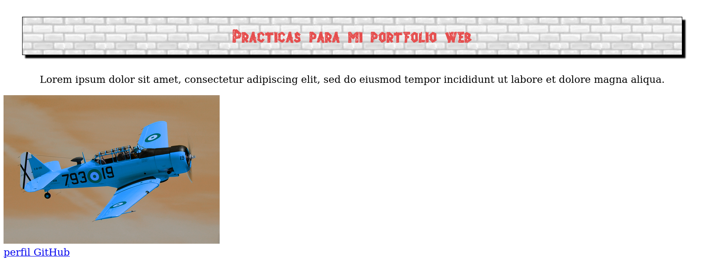

- **invert(valor)** invierte los colores de la imagen, produciendo un negativo. Acepta valores entre 0.1 y 1.

- **saturate(valor)** satura los colores de la imagen, acepta números decimales entre 0.1 y 10.

  Para que se vea que estos filtros no son solo aplicables a imágenes, sino que se pueden aplicar a otros elementos del documento, aquí un ejemplo de **invert()** en la cabecera:

  ```
  header {
  background: url("Media/ladrillosclaros.jpg");
  margin: 30px;
  padding: 15px;
  text-align: center;
  border: 1px solid;
  box-shadow:5px 5px 2px #010080;
  filter: invert(1)
  }
  ```

  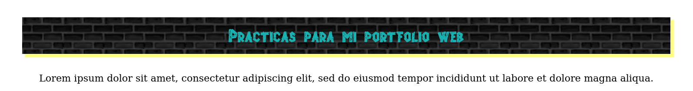

  - **opacity(valor)** acepta valores entre 0 y 1, siendo 0 totalmente transparente y 1 totalmente opaco.
