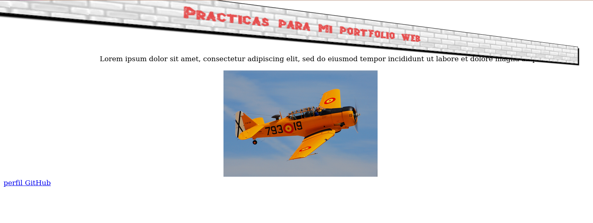

# Propiedades - 8ª parte

## Transformaciones

Podemos modificar la posición, tamaño y apariencia de los elementos HTML con el atributo **transform**. Esta propiedad realiza cuatro transformaciones básicas: escalado, rotación, inclinación y translación, valiéndose de las siguientes funciones:

- **scale(x,y)** modifica la escala mediante números decimales o enteros. El tamaño original se preserva con el valor 1. Si damos un valor negativo a cualquiera de los ejes, se invierte la posición del elemento en el eje indicado. Si sólo se declara un valor, ese mismo valor se usa para ambos ejes. También se puede usar las funciones **scale(x)** y **scale(y)** para modificar las escalas de cada eje de forma independiente.

  ```
  header {
  background: url("Media/ladrillosclaros.jpg");
  margin: 30px;
  padding: 15px;
  text-align: center;
  border: 1px solid;
  box-shadow:5px 5px 2px #010080;
  transform: scale(2);
  }
  ```

  

  `transform: scale(1, -1);`

  

- **rotate(ángulo)** rota el elemento. Se puede declarar en *deg(grados), grad(gradianes), rad(radianes)* o *turn(espiras)*.

  Aquí rotamos 45 grados la cabecera en el sentido de las agujas del reloj:

  ```
  header {
  background: url("Media/ladrillosclaros.jpg");
  margin: 30px;
  padding: 15px;
  text-align: center;
  border: 1px solid;
  box-shadow:5px 5px 2px #010080;
  transform:rotate(45deg);
  }
  ```

  

- **skew(ángulo)** inclina el elemento, cambiando su simetría. El atributo representa los grados de desplazamiento en el eje vertical y horizontal. Los valores se pueden declarar en las mismas unidades que en la propiedad **rotate** y también de forma independiente:

  ```
  header {
  background: url("Media/ladrillosclaros.jpg");
  margin: 30px;
  padding: 15px;
  text-align: center;
  border: 1px solid;
  box-shadow:5px 5px 2px #010080;
  transform:skew(20deg);
  }

  .plane img {
  width:350px;
  transform:skew(-20deg, -15deg);
  }
  ```

  

- **translate(x,y)** Esta función desplaza el elemento a la posición determinada por los valores de los ejes x e y. Utiliza el sistema de coordenadas de píxeles en pantalla para establecer la posición del elemento en base a su posición actual, por lo que valores negativos siempre ubicarán el objeto a posiciones por encima y a la izquierda de donde se encuentra. Para declarar varias transformaciones a la vez para un mismo elemento, hay que separar las funciones por un espacio:

  ```
  .plane img {
  width:350px;
  transform:translateX(100px) rotate(45deg) skew(20deg) scale(1.5);
  }
  ```
  

  Cuando se aplican varias funciones de transformación a un elemento, se debe considerar que el orden es importante, ya que se alteran aspectos como el punto de origen o el centro del mismo, propiedades sobre las que las funciones siguientes trabajan.

  De la misma manera que podemos generar transformaciones en 2 dimensiones, también podemos hacerlo en tres dimensiones. El tercer eje que representa la profundidad se identifica con la letra z, y estas son las funciones que permiten modificar ese parámetro:

  **scale3d(x, y, z)*** acepta valores de números decimales para modificar el objeto en las tres dimensiones. Los valores de 1 mantienen el objeto sin modificación.
  *NOTA: He probado modificar la escala z y aparentemente no hay ningún cambio, aunque además he rotado la imagen para ver si se la dotaba de profundidad, pero no.*

  **rotate3d(x, y, z, ángulo)** rota el elemento en un eje y ángulo específicos. Los ejes se especifican en números decimales, el ángulo acepta las unidades para este parámetro que hemos visto anteriormente además de los grados(deg). Los valores de los ejes generan un vector de rotación al que luego se le aplica el ángulo.

  **translate3d(x,y,z)** mueve el objeto a una nueva posición en el espacio 3d, acepta 3 valores en píxeles.

  **perspective(valor)** agrega un efecto de profundidad al elemento incrementando el tamaño del lado cercano al espectador.

  *NOTA: Algunas transformaciones 3d precisan que primero se cambie la perspectiva. Por ejemplo, si rotamos el elemento en el eje y un lado del mismo se desplazará hacia alante y el otro hacia atrás, pero el tamaño de cada lado permanecerá igual y el usuario no percibirá la transformación. Por ello es necesario declarar primero la perspectiva:*

  ```
  header {
    background: url("Media/ladrillosclaros.jpg");
    margin: 30px;
    padding: 15px;
    text-align: center;
    border: 1px solid;
    box-shadow:5px 5px 2px #000000;
    transform:translate3d(500px,200px, 0px) perspective(500px) rotate3d(0, 1, 0,55deg);
  }
  ```
  

  **perspective** es una propiedad similar a la que acabamos de ver, pero para ser aplicada al elemento padre. Se aplicará un efecto perspectiva a todos los elementos contenidos en su interior.

  **perspective-origin** cambia las coordenadas x e y del espectador. Acepta dos valores en porcentaje, píxeles, o las palabras clave center, left, right, top y bottom. Los valores por defecto son 50% 50%

  **backface-visibility** determina si la cara posterior del elemento será visible o no mediante los valores **visible** o **hidden**. Por defecto será visible.

  Ejemplo asignando **perspective** y **perspective-origin** al `<body>` de nuestro documento para rotar la imagen y la cabecera, al tiempo que se modifican las coordenadas del espectador:

  ```
  body {
    perspective: 800px;
    perspective-origin: right;
  }

  header {
    background: url("Media/ladrillosclaros.jpg");
    margin: 30px;
    padding: 15px;
    text-align: center;
    border: 1px solid;
    box-shadow:5px 5px 2px #000000;
    transform:rotate3d(0, 1, 0,45deg);
  }

  .plane img {
    width:350px;
    transform:translateX(500px);
  }
  ```

  Como se puede observar, aunque el elemento padre ha sido dotado de *perspectiva*, solo aparece girado el elemento al que se le aplica rotación (header):

  
