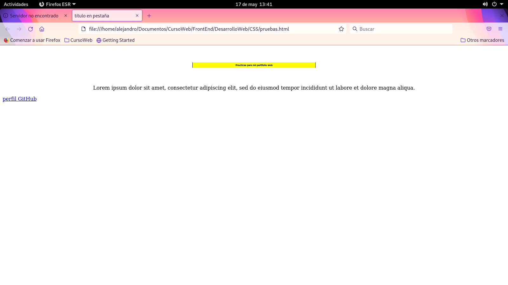
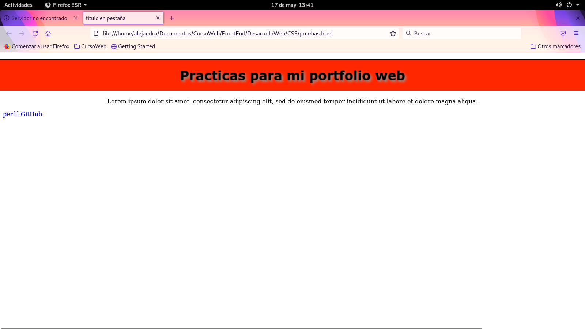
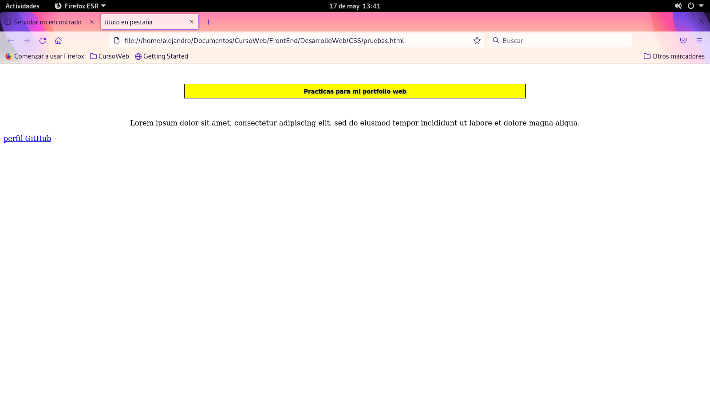

# Propiedades - 9ª parte

## Transiciones

Ya que una animación real requiere de una transición entre los dos pasos del proceso, podemos valernos de las siguientes propiedades CSS para generar dichas transiciones:

- **transition-property** especifica las propiedades que participan en la transición. Podemos incluirlas todas asignando el valor *all*.

- **transition-duration** especifica la duración en segundos.

- **transition-timing-function** determina la función que se usa para calcular los valores de la transición. Los valores disponibles son *ease, ease-in, ease-out, ease-in-out, linear, step-start, step-end*

- **transition-delay** indica al navegador el tiempo a esperar antes de iniciar la animación.

- **transition** nos permite declarar todos los valores de la transición al mismo tiempo.

Añadiendo esta línea a la regla de la imagen anterior veremos como se anima automáticamente al pasar el ratón por encima hasta alcanzar la posición especificada por la propiedad *transform*:

```
.plane img {
  width:350px;
  transition: transform 1s ease-in-out 0s;
```


La propiedad **transition** puede recibir hasta cuatro parámetros separados por un espacio. El primer valor es la propiedad que se considerará para crear la transición (transform en el ejemplo), el segundo parámetro determina la duración (1 seg), el tercero determina la manera en que se llevará a cabo la transición por medio de una curva Béizer, y el último parámetro determina cuantos segundos tarda la animación en comenzar.

## Animaciones

Hemos visto cómo crear una animación básica en CSS, pero solo involucrando dos estados en el proceso, el inicial y el final.

Para crear una animación real, necesitamos declarar más de dos estados, como si los fotogramas de una película se tratase. CSS provee las siguientes propiedades para la creación de animaciones más complejas:

- **animation-name** especifica el nombre usado para identificar los pasos de la animación. Es posible configurar más de una animación separando los nombres por coma.

- **animation-duration** se refiere a la duración de cada ciclo de la animación. Se especifica en segundos.

- **animation-timing-function** determina como se llevará a cabo el proceso de animación a través de los valores *ease, linear, ease-in, ease-out y ease-in-out*.

- **animation-delay** especifica el tiempo que el navegador esperará antes de iniciar la animación.

- **animation-iteration-count** declara la cantidad de veces que se ejecutará la animación. Acepta un núm entero o el valor *infinite*, el cual hace que la animación se ejecute por tiempo indefinido.

- **animation-direction** declara la dirección de la animación, que puede ser *normal, reverse, alternate (mezcla los ciclos de la animación, reproduciendo los que tienen un índice impar en dirección normal y el resto en dirección invertida), y alternate-reverse,* que hace lo mismo que alternate pero al contrario.

- **animation-fill-mode** define como afecta la animación a los estilos del elemento. Acepta los valores **none** por defecto, **forwards, backwards y both**. *forwards* aplica los estilos definidos en el último paso de la animación, *backwards* aplica los estilos del primer paso antes de ejecutarse, y *both* produce ambos efectos.

- **animation** como siempre, esta propiedad permite definir todos los valores de la propiedad al mismo tiempo.

Estas propiedades configuran la animación, pero los pasos se declaran con la regla `@keyframes`. Se debe usar con el nombre usado para declarar la animación, incluyendo la lista de propiedades que queremos modificar en cada paso. La posición en cada paso de la animación se determina por un valor en porcentaje, siendo 0% el primer fotograma y 100% el último:

```
header {
  margin: 30px;
  padding: 15px;
  text-align: center;
  border: 1px solid;
  animation: mianimacion 1s ease-in-out 0s infinite normal none;
}
@keyframes mianimacion {
  20% {
    background: #FFFFFF;
  }
  35% {
    transform: scale(0.5);
    background: #FFFF00;
  }
  50% {
    transform: scale(1.5);
    background: #FF0000;
  }
  65% {
    transform: scale(0.5);
    background: #FFFF00;
  }
  80% {
    background: #FFFFFF;
  }
}
```

En el ejemplo anterior, la animación comienza en el 20% y finaliza en el 80%, e incluye un total de 5 pasos. Cada paso de la animación modifica dos propiedades que cambian el valor del tamaño y el color de fondo, excepto el primer paso y el último que sólo cambian el color para lograr un efecto rebote.






