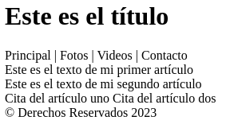
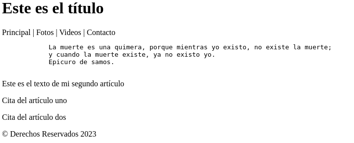
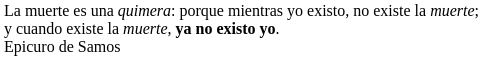

# Texto

HTML define varios elementos para determinar el propósito de cada palabra, frase o párrafo en el documento.

## Títulos

`<h1>` Es la etiqueta para declarar un título. HTML permite declarar también hasta seis niveles de subtítulos, que irán de `<h2>` a `<h6>`

Por ejemplo, en el documento creado en la sección anterior se incluye el título se la página. Como este es el título principal, debería representarse con el elemento `<h1>`, como en el siguiente ejemplo:

```
<header>
  <h1>Este es el título</h1>
</header>
```
Si añadimos el nuevo elemento a nuestro código anterior, tenemos algo como lo siguiente:



## Otros elementos de texto

Ahora veremos diferentes elementos que ofrece HTML para representar diferentes elementos de texto:

- `<p>` **párrafo**

- `<pre>` **texto con formato**

- `<span>` **estilos personalizados**

- `<p>` **párrafo**

Podemos usar `<p>` para dar formato a las citas de nuestro ejemplo.
Hay que considerar que este elemento no considera los saltos de línea a la hora de mostrar el texto, de igual manera si un párrafo contiene más de un espacio, el elemento `<p>` los reduce a un caracter.

Por ello, cuando deseemos fidelizar unos saltos de línea es recomendable usar `<pre>`:

```
<article>
  <pre>
    La muerte es una quimera, porque mientras yo existo, no existe la muerte;
    y cuando la muerte existe, ya no existo yo.
    Epicuro de samos.  
  </pre>
</article>
```
Si reemplazamos este texto en nuestro documento anterior y añadimos también el elemento `<p>` a las citas del segundo `<article>` tendremos algo así:



Se aprecia el espacio que genera automáticamente la etiqueta `<p>` y el formato por defecto que asigna la etiqueta `<pre>`

- `</br>` **salto de línea**

- `<wbr>` **sugiere salto de linea al navegador**

Así escribiríamos el texto anterior usando `<br>` en vez de `<pre>`:

```
<article>
  <p>La muerte es una quimera: porque mientras yo existo, no existe la muerte;<br>y cuando existe la muerte, ya no existo yo.<br>Epicuro de Samos</p>
</article>
```
- `<em>` **se usa para dar énfasis en cursiva**

- `<strong>` **para indicar importancia en negrita**

- `<i>` **voz alternativa o estado de humor en cursiva**

- `<u>` **texto no articulado, subrayado por defecto**

- `<b>` **igual que \<strong> cuando la anterior no resulta apropiada por algún motivo**

Ahora recreamos el texto anterior usando los nuevos elementos así:

```
<article>
  <p>La muerte es una <em>quimera</em>: porque mientras yo existo, no existe la <i>muerte</i>;<br>y cuando existe la <i>muerte</i>, <strong>ya no existo yo</strong>.<br>Epicuro de Samos</p>
</article>
```
y vemos lo siguiente:


