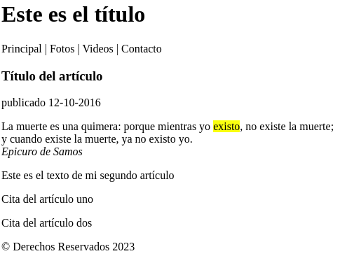

## Textos con propósito claramente definido:


- `<mark>` **resalta texto relevante por circunstancias actuales, como buscados por el usuario**

- `<small>` **letra pequeña para declaraciones legales, etc**

- `<cite>` **se usa para citar al autor  o título de una obra**

- `<adress>` **representa información de contacto, normalmente se usa en los pies de página para definir la dirección de la empresa o el sitio web.**

- `<time>` **representa una fecha en formato legible para el usuario.incluye el atributo datetime en formato yyyy-mm-dd y el atributo pubdate, para indicar que el valor de datetime es la fecha de publicación**

- `<code>` **para incluir código de programación. Normalmente se usa junto al elemento \<pre>**

- `<data>` **representa datos genéricos. Puede incluir el atributo value**


Como todos estos elementos representan información específica, normalmente se utilizan para complementar el contenido de otros elementos. Por ejemplo, podemos usar `<time>` para declarar la fecha en la que un artículo se ha publicado y otros elementos como `<mark>` o `<cite>` para dar significado a algunas partes del texto:

```
<article>
  <header>
    <h1>Título del artículo</h1>
    <time datetime="2016-10-12" pubdate>publicado 12-10-2016</time>
  </header>
  <p>La muerte es una quimera: porque mientras yo <mark>existo</mark>, no existe la muerte;<br>y cuando existe la muerte, ya no existo yo.<br><cite>Epicuro de Samos</cite></p>
</article>
```

Ahora tras expandir el `<article>` del ejemplo anterior con nuevos elementos, tenemos lo siguiente:


