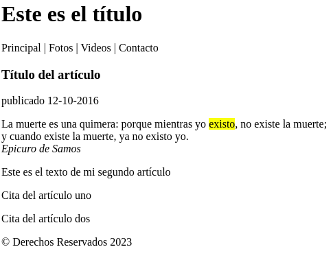

## Textos con propósito claramente definido:


- `<mark>` **resalta texto relevante por circunstancias actuales, como buscados por el usuario**

- `<small>` **letra pequeña para declaraciones legales, etc**

- `<cite>` **se usa para citar al autor  o título de una obra**

- `<adress>` **representa información de contacto, normalmente se usa en los pies de página para definir la dirección de la empresa o el sitio web.**

- `<time>` **representa una fecha en formato legible para el usuario.incluye el atributo datetime en formato yyyy-mm-dd y el atributo pubdate, para indicar que el valor de datetime es la fecha de publicación**

- `<code>` **para incluir código de programación. Normalmente se usa junto al elemento \<pre>**

- `<data>` **representa datos genéricos. Puede incluir el atributo value**


Como todos estos elementos representan información específica, normalmente se utilizan para complementar el contenido de otros elementos. Por ejemplo, podemos usar `<time>` para declarar la fecha en la que un artículo se ha publicado y otros elementos como `<mark>` o `<cite>` para dar significado a algunas partes del texto:

```
<article>
  <header>
    <h1>Título del artículo</h1>
    <time datetime="2016-10-12" pubdate>publicado 12-10-2016</time>
  </header>
  <p>La muerte es una quimera: porque mientras yo <mark>existo</mark>, no existe la muerte;<br>y cuando existe la muerte, ya no existo yo.<br><cite>Epicuro de Samos</cite></p>
</article>
```

Ahora tras expandir el `<article>` del ejemplo anterior con nuevos elementos, tenemos lo siguiente:



- `<!-- -->` **comentarios. Es la manera de introducir lineas de información para el desarrollador en el documento sin que sean ejecutadas por el navegador.**

## Enlaces

Conectar documentos con otros documentos es lo que hace posible navegar por la web.
HTML incluye el elemento `<a>` para tal fin. Se usa con el atributo **href** para incluir la nueva URL.

Los enlaces pueden conectar con otros documentos del mismo servidor (misma página) o documentos distintos en otros servidores o webs.

También puede incluir el atributo **target** que normalmente incorpora el valor *_self*, para abrir el recurso en la misma ventana, o bien el valor *_blank*, para abrir el documento en otra ventana, de forma que el usuario no abandona nuestro sitio web.

Por otra parte , los enlaces pueden conectar con otras partes del mismo documento. Esto sirve para que el navegador desplace la página hacia el punto que interesa al usuario cuando se pulsa el enlace.

El elemento al que queremos enlazar tiene que ser identificado con el atributo **id** seguido del valor. Luego, para acceder a esa posición, en el enlace usaremos en **href** ese mismo valor precedido por el símbolo **#**

Asi podríamos tener como destino por ejemplo:

```
<header id="titulo">
    <h1>Este es el título</h1>
</header>
```  

y más abajo en la página acceder a ello desde un elemento `<p>`:

```
<section>
      <p>Artículo 1</p>
      <p>Artículo 2</p>
      <p>Artículo 3</p>
      <p>Artículo 4</p>
      <p><a href="#titulo">Volver</a></p>
</section>
```
Al pulsar en "Volver" el navegador volverá para el `<header>`

Esto lo expliqué también en mi primer repositorio de desarrollo web, dejo aquí el [enlace](https://ehdinayan.github.io/E01-format/)
