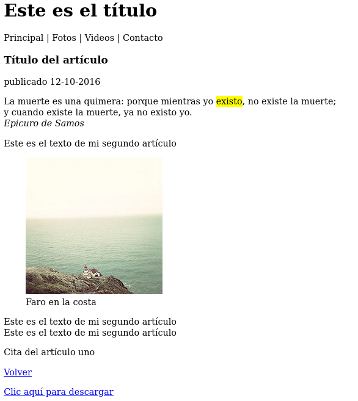

# Imagenes

Las imágenes se pueden considerar el segundo medio más importante en la web. Eston son los elementos más importantes de HTML para introducir imágenes en nuestros documentos:

- `` **inserta una imagen en el documento. Requiere del atributo src para especificar la ubicación de la misma.**

- `<picture>` **Este elemento inserta una imaagen en el documento. Trabaja con el elemento \<source> para ofrecer varias imagenes a diferentes resoluciones.Es útil para crear sitios web adaptables, como veremos más adelante.**

- `<figure>` **representa contenido relacionado con el contenido principal, pero que se puede eliminar sin que se vea afectado. Principalmente fotos, videos, etc.**

- `<figcaption>` **introduce un título para el elemento \<figure>**

La imagen se representa en su tamaño original, pero podemos definir un tamaño personalizado y algunos parámetros de configuración usando el resto de **atributos disponibles para el elemento** ``:

- `width` **declara el ancho de la imagen.**

- `height` **declara la altura.**

*NOTA: Para no deformar la imagen, es mejor declarar sólamente una de las dimensiones y dejar que el navegador calcule la otra, así se mantiene la proporción.*

- `alt` **especifica el texto que se muestra si por algún motivo la imagen no se puede cargar.**

- `scrset` **permite especificar una lista de imágenes a distintas resoluciones que el navegador puede cargar pare un mismo elemento.**

- `sizes` **este atributo especifica una lista de medios-media queries-con distintos tamaños de imágenes para que el navegador decida qué debe mostrar en función de la resolución de la pantalla.
Es una característica de diseño web adaptable que veremos más adelante.**

- `crossorigin` **Este atributo establece las credenciales para imágenes de origen cruzado-varios orígenes. Los valores posibles son anonymous y use-credentials. Esto pertenece a la tecnología CORS y veremos como trabajar con imágenes de diferentes orígenes también más adelante.**

Vamos a usar el elemento `` en una sección del documento anterior. Ubicaremos la imagen en un `<figure>`, le daremos atributos de descripción, proporción y añaciremos `<figcaption>` como información adicional:

```
<figure>
  
  <figcaption>Faro en la costa</figcaption>
</figure>
```

Este sería el resultado:


