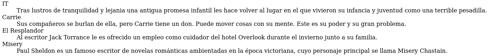
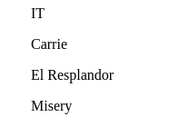
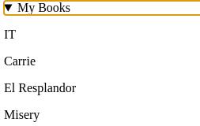

# Listados

Existen diversos elementos con los que HTML permite generar listados, algunos de ellos ya los he dejado expuestos en el repositorio [E03-llistes](https://github.com/ehdinayan/E03-llistes), de forma que aquí sólo añadiré un nuevo elemento: `<dl>`

- `<dl>` **crea una lista de términos y descripciones junto a otros elementos `<dt>` y `<dd>` para definir los itemes de la lista. El primero define la lista, el segundo los términos y el tercero las descripciones**

Estos elementos trabajan de forma similar a como lo hace `<ul>`, pero su propósito es mostrar una lista de términos y descripciones. Los términos se representan por el elemento `<dt>` y las descripciones por `<dd>`

Por defecto, este tipo de listas reciben formatos automáticos por parte del navegador, como márgenes a los lados para diferenciar los términos de las descripciones:

```
<aside>
  <dl>
    <dt>IT</dt>
    <dd>Tras lustros de tranquilidad y lejania una antigua promesa infantil les hace volver al lugar en el que vivieron su infancia y juventud como una terrible pesadilla.</dd>
    <dt>Carrie</dt>
    <dd>Sus compañeros se burlan de ella, pero Carrie tiene un don. Puede mover cosas con su mente. Este es su poder y su gran problema.</dd>
    <dt>El Resplandor</dt>
    <dd>Al escritor Jack Torrance le es ofrecido un empleo como cuidador del hotel Overlook durante el invierno junto a su familia.</dd>
    <dt>Misery</dt>
    <dd>Paul Sheldon es un famoso escritor de novelas románticas ambientadas en la época victoriana, cuyo personaje principal se llama Misery Chastain.</dd>
  </dl>
</aside>
```


Se aprecia los márgenes en la imagen del navegador.

Existen otros elementos que fueron diseñados para otros fines pero también son usados para la realización de listas. Tal es el caso de
`<blockquote>`, del que también he dado explicaciones en el repositorio [E04-blockquote-cite](https://github.com/ehdinayan/E04-blockquote-cite)

El caso es que cuando no se usa el atributo *cite*, blockquote por si mismo puede generar una lista de cualquier cosa sin marcar ni enumerar:

```
<aside>
  <blockquote>IT</blockquote>
  <blockquote>Carrie</blockquote>
  <blockquote>El Resplandor</blockquote>
  <blockquote>Misery</blockquote>
</aside>
```
Esto dará como resultado:



En sitios web modernos son comunes herramientas de despliegue de información, como por ejemplo lo permite el elemento `<details>`.
Este elemento muestra un título, especificado por el elemento `<summary>`, y contenido que se puede representar por elementos como `<p>` o `<blockquote>`. Así, el elemento `<details>` se puede usar para revelar una lista de valores:

```
<details>
  <summary>My Books</summary>
  <p>IT</p>
  <p>Carrie</p>
  <p>El Resplandor</p>
  <p>Misery</p>
</details>

```

Que resulta en el desplegable siguiente:



Cuando se pulsa, la flecha señala para abajo y se ve el contenido de "My Books"
