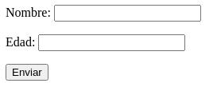

# Formularios

El propósito principal de los formularios es permitir al usuario seleccionar o insertar información y enviarla al servidor para ser procesada.

El formulario queda definido por el elemento `<form>`, que agrupa entre sus etiquetas de apertura y cierre al resto de elementos y que incluye algunos atributos para determinar como se envía la información al servidor.

- `name` **especifica el nombre del formulario. También se encuentra disponible para otros elementos.**

- `method` **determina el método a emplear para enviar la información al servidor. Existen 2 valores posibles: GET y POST.
El primero envía una cantidad limitada a 255 caracteres de información de forma pública a través de la URL. El método POST, en cambio, envía la cantidad de información que se necesite de forma privada.**

- `action` **este atributo declara la URL del archivo en el servidor que va a procesar la información enviada por el formulario.**

- `target` **determina donde será mostrada la respuesta recibida por el servidor. Los valores posibles son _blank para nueva ventana y _self para mismo recuadro, _parent para el recuadro padre y _top para la ventana que contiene el recuadro. El valor declarado por defecto es _self.**

- `enctype` **declara el tipo de encriptación para los datos que envía el formulario. Existen tres posibilidades:**

    1 *application/x-www-form-urlencoded* - Los caracteres son codificados.

    2 *multipart/form-data* - Los caracteres no son codificados.

    3 *text/plain* - Solo los espacios son codificados.

    El valor que se aplica por defecto es el primero.

- `accept-charset` **declara el tipo de codificación aplicada al texto del formulario. Los valores más comunes son UTF-8 e ISO-8859-1. El valor por defecto es el que se asigna por defecto al documento con el elemento `<meta>`**

En un formulario básico, tendríamos los atributos `name`, `method` y `action`, definiendo las características anteriormente explicadas:

```
<!DOCTYPE html>
<html lang="es">
<head>
  <meta charset="utf-8">
  <title>Formularios</title>
</head>
<body>
  <section>
    <form name="formulario" method="get" action="procesar.php">

    </form>
  </section>
</body>
</html>
```

**procesar.php** es el archivo que se ejecutará en el servidor para procesar la información y devolver el resultado. En este punto no se vería nada en el navegador porque el formulario se ha declarado vacío.
Desarrolleremos du contenido con los siguientes elementos:

`<input>` **crea un campo de entrada, que puede ser de diferente tipo dependiendo del valor  que se de al atributo type.**

`<textarea>` **crea un campo de entrada para insertar múltiples líneas de texto. El tamaño se puede declarar con números enteros usando los atributos rows y cols, o en píxeles con CSS como se verá más adelante.**

`<select>` **trabaja junto con el elemento `<option>` para definir cada opción en una lista de opciones y también con `<optgroup>` para  organizar las opciones en grupos.**

`<button>` **crea un botón que puede tener varias funciones dependiendo del valor del atributo type. Puede ser submit para enviar los datos, reset para reiniciarlo o button para realizar tareas personalizadas.**

El elemento `<input>` es el más versátil de todos, pudiendo adoptar diferentes tipos de características y aceptar diferentes tipos de valores en función del valor del atributo type también.

Como no es mi intención reproducir el libro, dejaré que los elementos vayan apareciendo en los ejemplos en vez de explicarlos uno a uno.

Para incluir un formulario en nuestro documento, tenemos que declararlo con el elemento `<form>` y luego añadir todos los demás elementos que el usuario necesitará para insertar la información y enviarla al servidor.

La información insertada en el formulario se envía al servidor para ser procesada. Para que el servidor pueda identificar cada valor, los elementos deben incluir el atributo *name*. Con el podemos asignar un nombre único a cada elemento.

Los formularios necesitan descripciones que le indiquen al usuario los datos que puede introducir. Esto se hace con el elemento `<label>`. Para asociar cada marca con su elemento correspondiente en el formulario, podemos incluir el elemento de formulario dentro del elemento `<label>`.

```
<!DOCTYPE html>
<html lang="es">
<head>
  <meta charset="utf-8">
  <title>Formularios</title>
</head>
<body>
  <section>
    <form name="formulario" method="get" action="procesar.php">
      <p>
        <label>Nombre: <input type="text" name="nombre"></label>
      </p>
      <p>
        <label>Edad: <input type="text" name="edad"></label>
      </p>
      <p><input type="submit" value="Enviar"></p>
    </form>
  </section>
</body>
</html>
```

Se puede usar el atributo *value* para indicar el texto que nos gustaría que apareciese en el botón en lugar de la opción por defecto
"submit".

Con eso obtenemos el siguiente resultado:


