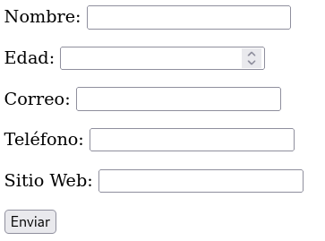
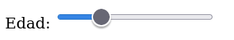
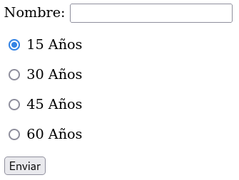
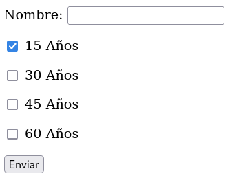

# Formularios - 2ª parte

El mismo atributo *value* también se puede usar para incluir valores iniciales en campos del formulario, de forma que aparecerán ya cumplimentados con la información que ya se conocía.

- `<maxlenght>` **especifica el máx núm de caracteres que se puede incluir en un campo.**

- `<minlenght>` **especifica el mínimo número de caracteres.**

Para asegurar que la información que se va a introducir en los campos
sea la correcta, se puede hacer que en cada campo se acepten únicamente los caracteres adecuados con los valores *number*, *email*, *tel* o *url* para el atributo **type**.

En un campo tipo *text*, cualquier caracter introducido por el usuario se considerará válido, aunque hayamos usado un label para correo electrónico:

```
<form name="formulario" method="get" action="procesar.php">
  <p><label>Nombre: <input type="text" name="nombre" maxlength="15"></label></p>
  <p><label>Edad: <input type="number" name="edad"></label></p>
  <p><label>Correo: <input type="email" name="correo"></label></p>
  <p><label>Teléfono: <input type="tel" name="telefono"></label></p>
  <p><label>Sitio Web: <input type="url" name="sitioweb"></label></p>
  <p><input type="submit" value="Enviar"></p>
</form>
```

Todos estos tipos de campos tienen sus propias restricciones, aunque se ven muy similares en el navegador:



Para el atributo *number*, existen los valores *min*, *max* y *step*, con los que se puede definir los valores disponibles a introducir así como el incremento o decremento cada vez que pulsamos las flechas del campo Edad.

También se puede representar un campo en el que introducir valores entre un mínimo y un máximo como una barra con deslizador para hacer la selección. Esto se hace con el atributo *range* en vez de number:

`<input type="range" name="edad" min="13" max="100" value="35">`

Con lo que nos aparecerá lo siguiente:



También hay otros valores para el atributo type que nos permiten personalizar aún más nuestuos formularios.

El tipo **radio** crea un botón circular que se resalta cuando se selecciona. Esto permite crear listas de valores que el usuario puede seleccionar con solo hacer click en el botón correspondiente.

Habremos de usar un elemento `<input>` por cada opción. Los elementos se asocian entre ellos por valor del atributo *name* y el valor de cada opción se define por el atributo *value*, como se ve en el ejemplo:

```
<form name="formulario" method="get" action="procesar.php">
  <p><label>Nombre: <input type="text" name="nombre" maxlength="15"></label></p>
  <p><label><input type="radio" name="edad" value="15" checked> 15 Años</label></p>
  <p><label><input type="radio" name="edad" value="30"> 30 Años</label></p>
  <p><label><input type="radio" name="edad" value="45"> 45 Años</label></p>
  <p><label><input type="radio" name="edad" value="60"> 60 Años</label></p>
  <p><input type="submit" value="Enviar"></p>
</form>
```

El atributo checked le dice al navegador que marque el círculo al cargar el documento, así aparece un valor seleccionado por defecto:



El valor asignado al atributo *value* de la opción seleccionada es el que se envía al servidor.

El tipo checkbox exige que asignemos diferentes nombres a cada elemento, de forma que podamos seleccionar una o varias casillas al mismo tiempo. Los valores de todas esas selecciones se enviarán al servidor:

```
<form name="formulario" method="get" action="procesar.php">
  <p><label>Nombre: <input type="text" name="nombre" maxlength="15"></label></p>
  <p><label><input type="checkbox" name="edad15" value="15" checked> 15 Años</label></p>
  <p><label><input type="checkbox" name="edad30" value="30"> 30 Años</label></p>
  <p><label><input type="checkbox" name="edad45" value="45"> 45 Años</label></p>
  <p><label><input type="checkbox" name="edad60" value="60"> 60 Años</label></p>
  <p><input type="submit" value="Enviar"></p>
</form>
```

De forma que:


