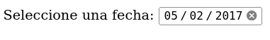
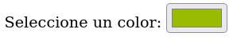
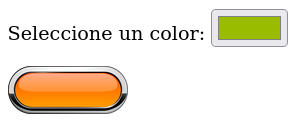
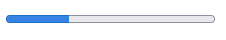
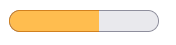

# Formularios - 3ª parte

Otra entrada que genera una herramienta visual en el navegador es **date**. Algunos navegadores lo implementan como un calendario que se despliega cada vez que se hace click en el campo date, que contendrá un *value* para mostrar por defecto en formato año-mes-dia:

`<input type="date" name="fecha" value="2017-02-05">`

En Firefox si funciona, pero no he podido capturar la imagen del calendario desplegado:

El tipo **date** no es el único para insertar fechas:

- `datetime-local` **formato año-mes-díaThoras:minutos:segundos.** La **T** en medio no es un error.

- `week` **formato año-semana con W entre los valores: 2023-W27.**

- `month` **formato año-mes.**

- `time` **formato horas-minutos.**

Todos estos valores para el atributo *type* del elemento **input** sirven para enviar los datos requeridos de forma optimizada.

Existe la posibilidad de enviar también colores como información en forma de número hexadecimal, para lo cual HTML también provee el tipo de entrada **color:**

`<input type="color" name="micolor" value="#99BB00">`

Para el botón de "submit" o el envío de datos, podemos optar por el tipo "image", que permite incluir una imagen en el botón para mejorar el diseño indicando el *src* y las proporciones.

`<input type="image" src="botonenviar.png" width="100">`

HTML ofrece un elemento más versátil para crear botones llamado `<button>`

Este resulta más apropiado para ser personalizado con estilos CSS o ser usado para ejecutar código JavaScript, como se verá más adelante.

Si tenemos un formulario que necesita reproducir información relacionada a medidas, tenemos los elementos `progress` y `meter`.
Aunque no son elementos propios de formulario, son útiles para estos casos.

- `<progress>` **se usa para indicar el progreso de una tarea. Requiere el atributo value para representar el progreso logrado hasta el momento y el atributo max para determinar el nivel a alcanzar para dar por terminada la tarea:**

  `<progress value="30" max="100">0%</progress>`

  

- `<meter>` **se usa para representar un rango de valores predefinido, por ejemplovel espacio ocupado en un disco duro. Utiliza los atributos min, max y value para representar el valor medido entre un máximo y un mínimo. Además, se vale de los atributos low, high y optimum, que se usan para segmentar el rango en secciones diferenciadas y declarar la posición óptima:**

  `<meter value="60" min="0" max="100" low="40" high="80" optimum="100">60</meter>`

  

El color de la barra depende del valor actual respecto a las secciones implementadas. Si el valor es inferior a low, la barra será roja, si está entre low y high, naranja y si supera el nivel de high será verde (en Firefox, al menos).
