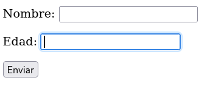

# Formularios - 4ª parte

## Atributos globales

Los siguientes son algunos de los atributos globales exclusivos de fomularios más usados de HTML:

- `disabled` **cuando el atributo está presente, el usuario no puede introducir valores en el campo.**

- `readonly` **indica que el valor del elemento no se puede modificar.**

El atributo **disabled** se usa cuando queremos indicar al usuario
que el elemento puede estar disponible en otras condiciones, como cuando se trata de un campo no aplicable en el país del usuario.
El atributo **readonly**, en cambio, se usa cuando sólo existe un valor posible y no queremos que el usuario lo cambie.

- `placeholder` **muestra un texto en el fondo del elemento para que el usuario sepa el valor que podría introducir.**

El siguiente ejemplo inserta esta ayuda en un campo de búsqueda:

```
<form name="formulario" method="get" action="procesar.php">
      <p><label>Buscar: <input type="search" name="buscar" placeholder="Término a buscar"></label></p>
      <p><input type="submit" value="Buscar"></p>
</form>
```


- `novalidate` **está disponible para los atributos que crean botones para enviar formularios. Impide que el formulario sea validado, aunque permite su envío.**

Por defecto, los formularios son validados a no ser que el atributo novalidate esté presente. A veces el proceso de validación es requerido sólo en ciertas circunstancias. Por ejemplo, cuando la información introducida debe ser grabada para permitir al usuario continuar con el trabajo más tarde.

- `required` **indica al navegador que el usuario debe introducir o insertar un valor que cumpla con los requisitos de su tipo en el campo que incluye este atributo para poder enviar el formulario:**

Este es un ejemplo de formulario con botón para enviar sin validar y con el atributo required en el campo:

```
<form name="formulario" method="get" action="procesar.php">
      <p><label>Correo: <input type="email" name="correo" required></label></p>
      <p>
        <input type="submit" value="Enviar">
        <input type="submit" value="Grabar" formnovalidate>
      </p>
</form>
```

Ese formulario no permitirá ser enviado con el primer botón a menos que se haya introducido alguna información de tipo correo electrónico en el campo requerido. En cambio, podrá ser enviado sin validar con el botón **Grabar.**

- `pattern` **define una expresión regular que el navegador debe usar para validar el valor insertado en el campo.**

Algunos tipos de campos de entrada validen cadenas de caracteres específicos, pero no pueden hacer nada cuando el valor no es estándar, como en el caso de los códigos postales. El atributo **pattern** nos permite crear un filtro personalizado usando expresiones regulares:

```
<form name="formulario" method="get" action="procesar.php">
  <p><label>Código Postal: <input pattern="[0-9]{5}" name="cp" title="Inserte su código postal"></label></p>
  <p><input type="submit" value="Enviar"></p>
</form>
  ```

La expresión regular definida en **pattern** indica que en el campo solo se pueden insertar cinco dígitos de valor comprendido entre 0 y 9 cada uno.

- `multiple` **atributo que indica al navegador que se pueden insertar múltiples valores en el campo. Se aplica a elementos input de tipo email y file**

- `autocomplete` **activa la herramienta de auto completar que sugiere al usuario que introducir según los valores insertados previamente.Requiere usar los valores on y off:**

```
<form name="formulario" method="get" action="procesar.php">
      <p><label>Buscar: <input type="search" name="buscar" autocomplete="off"></label></p>
      <p><input type="submit" value="Buscar"></p>
</form>
```

- `autufocus` **el atributo establece el foco en el elemento cuando se carga el documento. En el siguiente ejemplo, el campo de la edad posee el atributo autofocus, por lo que el navegador pondrá el cursor en ese campo por defecto:**

```
<form name="formulario" method="get" action="procesar.php">
  <p><label>Nombre: <input type="text" name="nombre"></label></p>
  <p><label>Edad: <input type="text" name="edad" autofocus></label></p>
  <p><input type="submit" value="Enviar"></p>
</form>
```



- `spellcheck` **solicita al navegador que compruebe la ortografía y gramática del valor introducido en el campo. Al ser un atributo booleano como muchos otros, se puede tener puesto pero desactivado poniendo su valor a "false":**

```
<form name="formulario" method="get" action="procesar.php">
  <p><label>Texto: <textarea name="texto" cols="50" rows="6" spellcheck="false"></textarea></label></p>
  <p><input type="submit" value="Enviar"></p>
</form>
```

Lo he estado probando activándolo y la verdad que al menos en Firefox no parece tener efecto este atributo.

- `form` **en forma de atributo, vincula un elemento input externo al cuerpo central del formulario con el formulario, como si también estuviera entre las etiquetas <form>. Para ello, el atributo form del campo input externo debe tener el mismo valor que el atributo id del formulario central:**

```
<nav>
  <p><input type="search" name="buscar" form="formulario"></p>
</nav>
<section>
  <form name="formulario" id="formulario" method="get" action="procesar.php">
    <p><input type="submit" value="Enviar"></p>
  </form>
</section>
```

El valor del atributo *form* es el mismo que el del atributo *id* del formulario central, **"formulario"**
