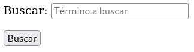

# Formularios - 4ª parte

## Atributos globales

Los siguientes son algunos de los atributos globales exclusivos de fomularios más usados de HTML:

- `disabled` **cuando el atributo está presente, el usuario no puede introducir valores en el campo.**

- `readonly` **indica que el valor del elemento no se puede modificar.**

El atributo **disabled** se usa cuando queremos indicar al usuario
que el elemento puede estar disponible en otras condiciones, como cuando se trata de un campo no aplicable en el país del usuario.
El atributo **readonly**, en cambio, se usa cuando sólo existe un valor posible y no queremos que el usuario lo cambie.

- `placeholder` **muestra un texto en el fondo del elemento para que el usuario sepa el valor que podría introducir.**

El siguiente ejemplo inserta esta ayuda en un campo de búsqueda:

```
<form name="formulario" method="get" action="procesar.php">
      <p><label>Buscar: <input type="search" name="buscar" placeholder="Término a buscar"></label></p>
      <p><input type="submit" value="Buscar"></p>
</form>
```



- `novalidate` **está disponible para los atributos que crean botones para enviar formularios. Impide que el formulario sea validado, aunque permite su envío.**

Por defecto, los formularios son validados a no ser que el atributo novalidate esté presente. A veces el proceso de validación es requerido sólo en ciertas circunstancias. Por ejemplo, cuando la información introducida debe ser grabada para permitir al usuario continuar con el trabajo más tarde.

- `required` **indica al navegador que el usuario debe introducir o insertar un valor que cumpla con los requisitos de su tipo en el campo que incluye este atributo para poder enviar el formulario:**

Este es un ejemplo de formulario con botón para enviar sin validar y con el atributo required en el campo:

```
<form name="formulario" method="get" action="procesar.php">
      <p><label>Correo: <input type="email" name="correo" required></label></p>
      <p>
        <input type="submit" value="Enviar">
        <input type="submit" value="Grabar" formnovalidate>
      </p>
</form>
```

Ese formulario no permitirá ser enviado con el primer botón a menos que se haya introducido alguna información de tipo correo electrónico en el campo requerido. En cambio, podrá ser enviado con el botón **Grabar.**
