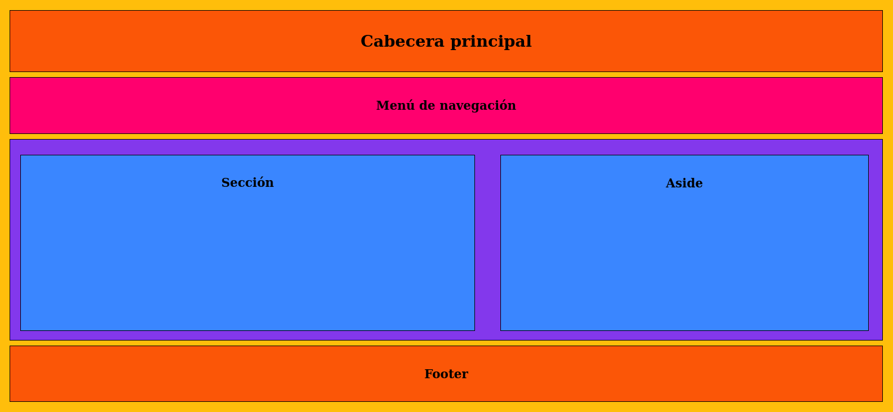

# HTML
## ESTRUCTURA - II

**Cuerpo**

Con la cabecera lista, es hora de construir el cuerpo. El código entre las etiquetas <body> es el encargado de generar la parte visible de niestuo documento (la página web).

`
` Es una división genérica que se usa cuando no se puede usar ningún otro elemento.

`<main>` Define una división que contiene el contenido principal de la página.

`<nav>` Define una división que contiene ayuda para la navegación, a modo de menú principal de la página o bloques de enlaces nesesarios.

`<section>` Al igual que `
`, también define una sección genérica.
Se usa frecuentemente para separar contenido temático, o para generar columnas o bloques que ayudan a organizar el contenido.

`<aside>` Define una sección relacionada con el contenido principal pero que no es parte del mismo, como referencias a artículos o enlaces a publicaciones anteriores.

`<article>` Representa un artículo independiente, como un mensaje de foro, artículo de una revista, entrada de blog, comentario, etc.

`<header>` Define la cabecera del cuerpo o de secciones dentro del cuerpo.

`<footer>` Define el pie del cuerpo o de secciones dentro del cuerpo.

Aquí se muestra una estructura básica de página web con CSS local que incluye todas las estructuras explicadas recientemente salvo `
` (irían distribuídas dentro de las otras secciones):

